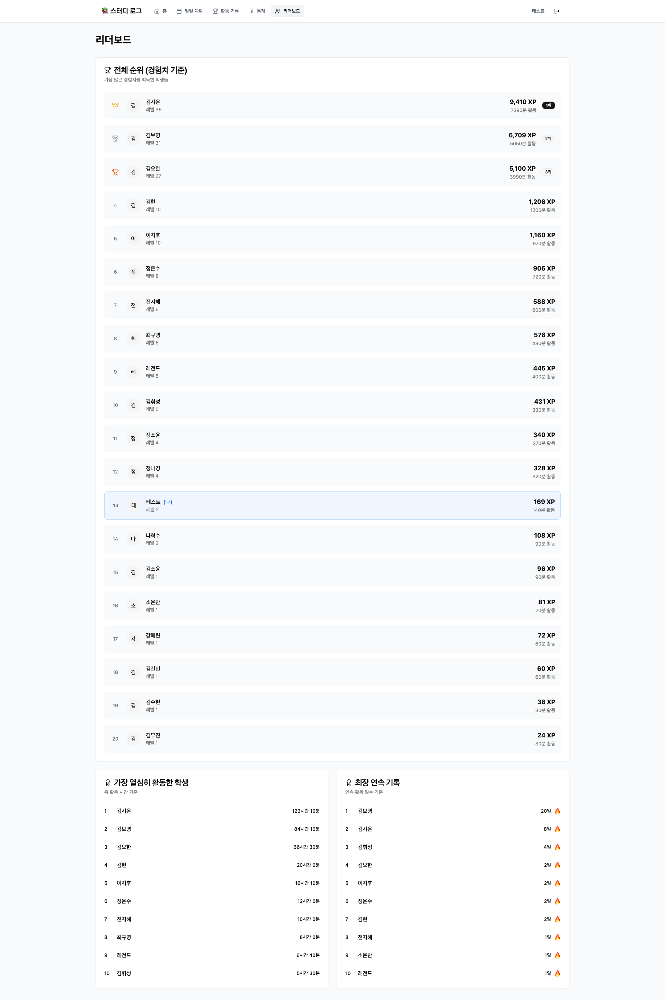

# 🎮 Study Log 기능 상세 설명

## 1. 🏠 홈페이지


### 기능 설명
- **랜딩 페이지**: 서비스 소개 및 주요 기능 안내
- **원클릭 시작**: "지금 시작하기" 버튼으로 즉시 로그인 페이지 이동
- **반응형 디자인**: 모바일, 태블릿, 데스크톱 모든 환경 지원
- **애니메이션 효과**: Framer Motion을 활용한 부드러운 전환 효과

### 주요 UI 요소
- 히어로 섹션: 서비스 가치 제안
- 특징 카드: 6가지 핵심 기능 소개
- CTA 버튼: 명확한 행동 유도

---

## 2. 🔐 로그인 시스템


### 기능 설명
- **이메일 인증**: 이메일/비밀번호 기반 로그인
- **회원가입**: 간단한 이메일 가입 프로세스
- **세션 관리**: NextAuth.js 기반 안전한 세션 관리
- **자동 리다이렉트**: 로그인 후 대시보드로 자동 이동

### 보안 기능
- 비밀번호 해싱 (bcrypt)
- CSRF 보호
- 세션 토큰 관리
- 안전한 쿠키 설정

---

## 3. 📊 대시보드


### 기능 설명
- **오늘의 요약**: 일일 활동 시간 및 획득 XP 표시
- **빠른 활동 기록**: 대시보드에서 바로 활동 추가 가능
- **레벨 프로그레스**: 현재 레벨과 다음 레벨까지 진행도
- **능력치 현황**: 5가지 능력치 실시간 표시

### 대시보드 구성 요소
1. **프로필 카드**
   - 사용자 이름 및 레벨
   - 총 XP 및 활동 시간
   - 현재 연속 달성 일수

2. **오늘의 계획**
   - 계획된 활동 목록
   - 완료율 표시
   - 빠른 완료 체크

3. **최근 활동**
   - 최근 5개 활동 표시
   - 획득 XP 및 시간 정보

---

## 4. 📝 활동 기록


### 기능 설명
- **활동 입력 폼**: 간편한 활동 기록 인터페이스
- **카테고리 선택**: 6가지 활동 카테고리 (학습, 운동, 독서, 취미, 봉사, 기타)
- **시간 제한**: 10분~60분 세션 제한으로 데이터 무결성 보장
- **즉시 피드백**: 활동 기록 시 획득 XP 즉시 표시

### 활동 기록 프로세스
1. 활동명 입력
2. 카테고리 선택
3. 활동 시간 설정 (10분 단위)
4. 선택적 메모 추가
5. 제출 및 XP 획득

### 데이터 검증
- 최소 10분, 최대 60분 제한
- 하루 최대 30개 활동 제한
- 일일 총 24시간 제한

---

## 5. 📅 계획 수립


### 기능 설명
- **일일 계획 작성**: 하루 학습 계획 미리 수립
- **계획 항목 관리**: 추가, 수정, 삭제 기능
- **목표 시간 설정**: 각 활동별 목표 시간 지정
- **완료 체크**: 계획된 활동 완료 표시

### 계획 기능 특징
- 카테고리별 계획 수립
- 예상 XP 미리보기
- 계획 대비 실제 달성률
- 연속 달성 동기부여

---

## 6. 📈 통계


### 기능 설명
- **아바타 디스플레이**: 캐릭터 레벨 및 능력치 시각화
- **경험치 프로그레스**: 현재 레벨 진행도 표시
- **능력치 게이지**: 5가지 능력치 동적 게이지
- **활동 분석**: 카테고리별 활동 시간 분포

### 통계 구성 요소
1. **레벨 & XP**
   - 현재 레벨 (1~100)
   - 누적 경험치
   - 다음 레벨 필요 XP

2. **능력치 상세**
   - 힘 (STR): 운동 활동
   - 지능 (INT): 학습/독서
   - 민첩성 (DEX): 취미 활동
   - 매력 (CHA): 봉사 활동
   - 활력 (VIT): 기타 활동

3. **성취 배지**
   - 획득한 배지 목록
   - 배지 등급 (브론즈/실버/골드)
   - 획득 조건 안내

---

## 7. 🏆 리더보드


### 기능 설명
- **전체 순위**: 모든 사용자의 XP 기준 순위
- **TOP 20 표시**: 상위 20명 사용자 랭킹
- **상세 정보**: 레벨, 총 XP, 활동 시간 표시
- **자신의 순위**: 현재 사용자 하이라이트

### 리더보드 특징
- 실시간 순위 업데이트
- 순위별 메달 아이콘 (1위 🥇, 2위 🥈, 3위 🥉)
- 활동 시간 포맷팅 (시간/분)
- 모바일 최적화 테이블

---

## 8. 🎯 게이미피케이션 시스템

### 경험치 시스템
```
기본 계산: 10분 = 10 XP
카테고리 가중치 적용
연속 달성 보너스 (20% 추가)
```

### 레벨 시스템
- **지수 성장**: 레벨당 5% 증가
- **최대 레벨**: 100
- **시각적 피드백**: 프로그레스 바

### 배지 시스템
- **7가지 배지 타입**
- **3단계 등급** (브론즈/실버/골드)
- **자동 획득**: 조건 달성 시 자동 부여

### 연속 달성
- **일일 체크**: 매일 활동 기록 확인
- **보너스 XP**: 연속 일수에 따른 추가 경험치
- **동기부여**: 꾸준한 학습 습관 형성

---

## 9. 🔒 데이터 보안 및 무결성

### 입력 검증
- **클라이언트**: HTML5 폼 검증
- **서버**: API 레벨 검증
- **데이터베이스**: 제약조건 설정

### 세션 관리
- **NextAuth.js**: 산업 표준 인증
- **JWT 토큰**: 안전한 세션 관리
- **자동 로그아웃**: 비활성 시 자동 종료

### 데이터 정리
- **자동 스크립트**: 비정상 데이터 감지 및 수정
- **백업 시스템**: 정기적 데이터 백업
- **복구 프로세스**: 데이터 손실 시 복구 절차

---

## 10. 📱 반응형 디자인

### 모바일 최적화
- **터치 친화적**: 큰 버튼과 입력 영역
- **스와이프 지원**: 네비게이션 제스처
- **최적화된 레이아웃**: 화면 크기별 최적화

### 크로스 브라우저
- Chrome, Safari, Firefox, Edge 지원
- PWA 지원 (설치 가능한 웹앱)
- 오프라인 기능 (제한적)

### 접근성
- ARIA 레이블
- 키보드 네비게이션
- 고대비 모드 지원
- 스크린 리더 호환

---

## 11. 🚀 성능 최적화

### 프론트엔드
- **Next.js 최적화**: 자동 코드 분할
- **이미지 최적화**: Next/Image 컴포넌트
- **캐싱 전략**: 정적 자산 캐싱

### 백엔드
- **데이터베이스 쿼리**: Prisma ORM 최적화
- **API 응답 캐싱**: 자주 사용되는 데이터 캐싱
- **연결 풀링**: 데이터베이스 연결 관리

### 배포
- **Railway 플랫폼**: 자동 스케일링
- **CDN**: 정적 자산 전송 최적화
- **Zero-downtime 배포**: 무중단 업데이트