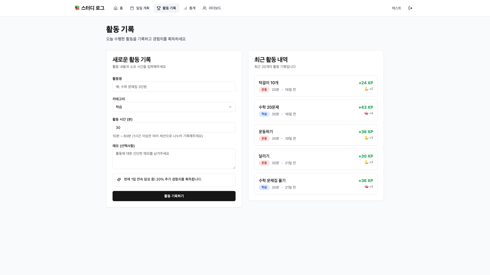

# 📚 Study Log - 게이미피케이션 학습 관리 시스템

## 🎯 프로젝트 개요

Study Log는 학생들의 자기주도 학습을 게임화 요소를 통해 동기부여하는 혁신적인 학습 관리 플랫폼입니다. 학습 활동을 경험치(XP)와 레벨로 변환하여 학습 과정을 RPG 게임처럼 즐겁게 만들어줍니다.

### 핵심 가치
- **동기부여**: 게임 메커니즘을 통한 지속적인 학습 동기 부여
- **시각화**: 성장과 진전을 직관적으로 확인
- **경쟁과 협력**: 리더보드를 통한 건전한 경쟁
- **자기주도성**: 스스로 계획하고 실행하는 학습 습관 형성

## 🌟 주요 기능

### 1. 게이미피케이션 시스템
- **경험치(XP) 시스템**: 활동 시간과 카테고리에 따른 XP 획득
- **레벨 시스템**: 1~100 레벨까지 성장 가능
- **능력치 시스템**: 5가지 능력치 (힘, 지능, 민첩성, 매력, 활력)
- **배지 시스템**: 성취에 따른 다양한 배지 획득
- **연속 달성 보너스**: 매일 활동 시 추가 XP 보너스

### 2. 학습 관리 기능
- **활동 기록**: 학습, 운동, 독서 등 다양한 활동 기록
- **일일 계획**: 하루 학습 계획 수립 및 관리
- **통계 대시보드**: 개인 성장 데이터 시각화
- **리더보드**: 전체 사용자 순위 확인

### 3. 데이터 무결성
- **세션 제한**: 한 번에 최대 60분 활동 기록
- **일일 제한**: 하루 최대 24시간, 30개 활동
- **자동 검증**: 비정상 데이터 자동 필터링

## 💻 기술 스택

### Frontend
- **Framework**: Next.js 14 (App Router)
- **Language**: TypeScript
- **Styling**: Tailwind CSS
- **UI Components**: shadcn/ui
- **State Management**: React Server Components

### Backend
- **Runtime**: Node.js
- **API**: Next.js API Routes
- **Authentication**: NextAuth.js
- **ORM**: Prisma
- **Database**: PostgreSQL

### Infrastructure
- **Deployment**: Railway
- **Version Control**: Git/GitHub
- **CI/CD**: Automatic deployment via Railway

## 📊 게임 메커니즘

### XP 계산 공식
```
기본 XP = (활동 시간(분) / 10) * 10
최종 XP = 기본 XP * 카테고리 가중치 * 연속 달성 보너스
```

### 카테고리별 가중치
- 학습: 1.2x
- 독서: 1.1x
- 봉사: 1.1x
- 운동: 1.0x
- 취미: 0.9x
- 기타: 0.8x

### 레벨 시스템
- 레벨 1: 100 XP 필요
- 레벨당 5% 증가율
- 레벨 100: 약 12,000 XP 필요

## 🎮 능력치 시스템

| 능력치 | 아이콘 | 향상 활동 | 설명 |
|--------|--------|------------|------|
| 힘 (STR) | 💪 | 운동 | 신체적 힘과 체력 |
| 지능 (INT) | 🧠 | 학습, 독서 | 지적 능력과 학습력 |
| 민첩성 (DEX) | 🤸 | 취미 | 손재주와 반응속도 |
| 매력 (CHA) | ✨ | 봉사 | 사회성과 리더십 |
| 활력 (VIT) | 🔥 | 기타 | 전반적인 활력 |

## 🏆 배지 시스템

### 배지 종류
- **학습의 달인**: 학습 활동 누적 시간 달성
- **운동의 달인**: 운동 활동 누적 시간 달성
- **독서왕**: 독서 활동 누적 시간 달성
- **취미의 달인**: 취미 활동 누적 시간 달성
- **봉사왕**: 봉사 활동 누적 시간 달성
- **연속 달성**: 연속 일수 달성
- **레벨 마일스톤**: 특정 레벨 도달

### 배지 등급
- 🥉 브론즈 (Tier 1)
- 🥈 실버 (Tier 2)
- 🥇 골드 (Tier 3)

## 🚀 시작하기

### 요구사항
- Node.js 18.0 이상
- PostgreSQL 14 이상
- npm 또는 yarn

### 설치 및 실행
```bash
# 의존성 설치
npm install

# 환경 변수 설정
cp .env.example .env

# 데이터베이스 마이그레이션
npx prisma db push

# 개발 서버 실행
npm run dev
```

### 환경 변수
```
DATABASE_URL=postgresql://...
NEXTAUTH_URL=http://localhost:3000
NEXTAUTH_SECRET=your-secret-key
```

## 📱 주요 화면

### 홈페이지


### 대시보드


### 활동 기록


### 리더보드


## 🎯 대회 제출 정보

- **프로젝트명**: Study Log
- **카테고리**: 교육 기술 (EdTech)
- **대상**: 중고등학생 및 일반 학습자
- **핵심 혁신**: 게이미피케이션을 통한 학습 동기부여
- **데모 URL**: https://vacation-production-f151.up.railway.app
- **GitHub**: https://github.com/JihunKong/vacation

## 📞 문의

프로젝트에 대한 문의사항이나 제안은 GitHub Issues를 통해 연락주시기 바랍니다.